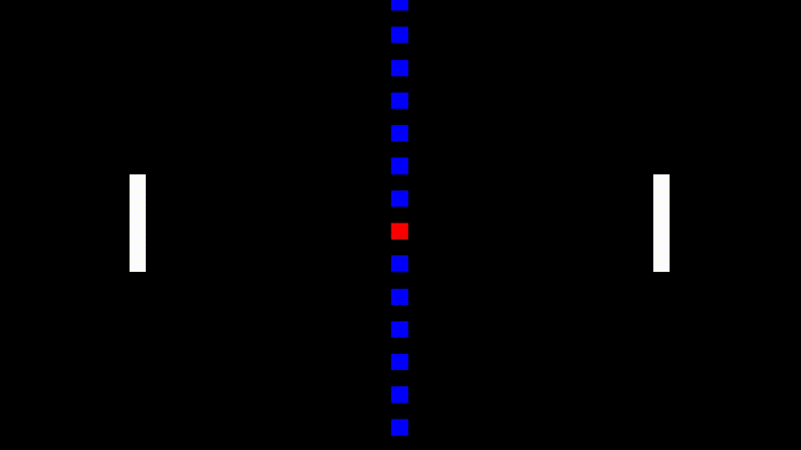

	<h1 align="center">8pong</h2>
	
A small and simple pong game

	
	
	
	   
	

## Table of contents
* [Introduction](#introduction)
* [Bugs](#bugs)
* [Dependencies](#dependencies)
* [Make](#make)

## Introduction
Small and simple [pong](https://en.wikipedia.org/wiki/Pong) game made in C using SDL2.

## Bugs
If you find any bugs, please create an issue and report them.

## Dependencies
- [SDL2](https://www.libsdl.org/)

## Make
Run `make all` to see all the make rules, `make` to compile a binary.
